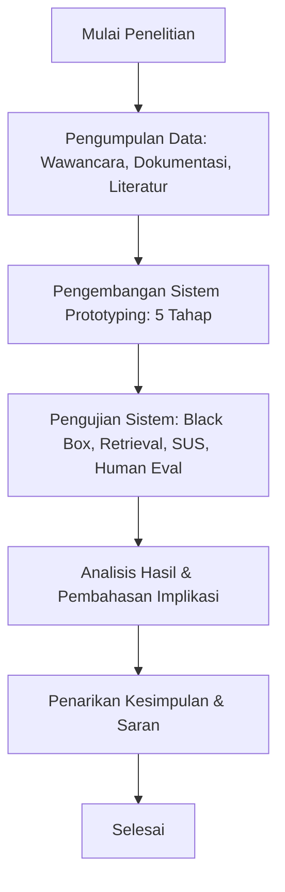

# BAB III: METODOLOGI PENELITIAN

[AWALAN BAB III]
Bab III ini menguraikan metodologi penelitian yang diterapkan dalam membangun dan menguji sistem *Chatbot* Informasi Usaha Percetakan berbasis *Retrieval-Augmented Generation* (RAG). Pembahasan disusun secara rinci mengikuti urutan alur penelitian, jenis penelitian, objek dan fokus penelitian, metode pengumpulan data, serta tahap-tahap dalam metode pengembangan sistem *Prototyping*.

---

## A. Alur Penelitian

[AWALAN SUB-BAB A]
Sub-bab ini menyajikan tahapan alur penelitian secara sistematis dari studi awal hingga penarikan kesimpulan.

> 🖼️ **[PENANDA GAMBAR 3.1 DI SKRIPSI WORD]:**
> **Gambar 3.1 Flowchart Alur Pelaksanaan Penelitian**

[PENJELASAN NARATIF GAMBAR 3.1]
Gambar 3.1 menggambarkan alur pelaksanaan penelitian yang berurutan. Penelitian dimulai dari pengumpulan data empiris dan studi literatur, dilanjutkan dengan pengembangan sistem menggunakan metodologi *Prototyping*, eksekusi 4 metode pengujian, hingga tahap analisis pembahasan dan penarikan kesimpulan.

[AKHIRAN SUB-BAB A]
Alur penelitian pada sub-bab ini memberikan gambaran ringkas tahapan kerja. Jenis penelitian yang diterapkan dijelaskan pada sub-bab berikutnya.

---

## B. Jenis Penelitian

[AWALAN SUB-BAB B]
Sub-bab ini menjelaskan klasifikasi jenis penelitian yang digunakan dalam skripsi ini.

### 1. Penelitian Rekayasa Perangkat Lunak (*Software Engineering Research*)
Penelitian ini tergolong ke dalam jenis penelitian rekayasa perangkat lunak (*software engineering research*) yang berfokus pada perancangan, pembuatan, dan pengujian produk aplikasi kecerdasan buatan berbasis *web* dan pesan instan.

### 2. Kombinasi Pendekatan Kuantitatif dan Kualitatif
Penelitian ini menerapkan pendekatan kombinasi: kuantitatif digunakan untuk menghitung persentase *Hit Rate@3*, *Precision@3*, serta skor *System Usability Scale* (SUS), sedangkan kualitatif digunakan untuk menganalisis narasi wawancara dan lembar evaluasi penilai manusia (*Human Evaluation*).

[AKHIRAN SUB-BAB B]
Penetapan jenis penelitian ini memperjelas metode analisis data. Objek dan fokus penelitian diuraikan pada sub-bab berikutnya.

---

## C. Objek dan Fokus Penelitian

[AWALAN SUB-BAB C]
Sub-bab ini menentukan batasan lokasi studi kasus dan fokus kajian ilmiah penelitian.

### 1. Objek Penelitian
Objek penelitian dilaksanakan pada CV. Asia Visual Grafika, sebuah usaha percetakan digital yang beroperasi di dua lokasi Pekanbaru, Riau (Cabang Utama Jl. HR. Soebrantas dan Cabang Retail Jl. Panam).

### 2. Fokus Penelitian
Fokus penelitian ini dititikberatkan pada pengembangan dan evaluasi kinerja sistem *Chatbot* RAG yang mampu menjawab pertanyaan informasi produk percetakan dan menghitung kalkulasi estimasi harga secara otomatis dan transparan.

[AKHIRAN SUB-BAB C]
Penetapan objek dan fokus penelitian menjaga sasaran pengujian tetap terarah. Metode pengumpulan data empiris dijelaskan pada sub-bab berikutnya.

---

## D. Metode Pengumpulan Data

[AWALAN SUB-BAB D]
Sub-bab ini menguraikan 3 metode pengumpulan data yang digunakan untuk membangun data basis pengetahuan dan kebutuhan sistem.

### 1. Wawancara
Wawancara terstruktur dan mendalam dilakukan bersama dua narasumber utama toko:
#### a. Wawancara bersama Bapak Aji
Wawancara dilakukan bersama Bapak Aji selaku *Owner* dan *Supervisor* toko untuk menggali permasalahan keterlambatan layanan pelanggan di WhatsApp dan kebijakan umum bisnis.
#### b. Wawancara bersama Mas Rizky
Wawancara dilakukan bersama Mas Rizky selaku Admin CS dan *Setter* toko untuk memvalidasi ketentuan DP (50-60%), syarat format berkas cetak, serta rumus perhitungan harga spanduk dan stiker.

### 2. Studi Dokumentasi
Studi dokumentasi dilaksanakan melalui dua sumber acuan data operasional:
#### a. Dokumentasi Buku Katalog Harga Percetakan
Menganalisis dokumen fisik dan berkas buku katalog daftar harga resmi CV. Asia Visual Grafika sebagai sumber rujukan utama penyusunan tabel harga per meter persegi, per lembar A3+, dan per pcs pada berkas `.txt`.
#### b. Dokumentasi Riwayat Chat WhatsApp (`msgstore.db.crypt`)
Menganalisis berkas basis data riwayat percakapan pelanggan WhatsApp (`msgstore.db.crypt`) milik toko untuk mengidentifikasi sampel pertanyaan populer dan variasi bahasa yang sering digunakan pelanggan saat bertransaksi.

### 3. Studi Literatur
Studi literatur dilakukan dengan mempelajari buku teks, dokumentasi resmi pustaka (*framework documentation*), dan artikel jurnal ilmiah terindeks yang membahas *Natural Language Processing*, arsitektur RAG, database vektor ChromaDB, model *embedding* `multilingual-e5-small`, LLM Gemini 2.5 Flash, dan *System Usability Scale* (SUS).

[AKHIRAN SUB-BAB D]
Tiga metode pengumpulan data di atas menghasilkan fakta empiris dan landasan teori yang kokoh. Metode pengembangan sistem diuraikan pada sub-bab berikutnya.

---

## E. Metode Pengembangan Sistem

[AWALAN SUB-BAB E]
Sub-bab ini memaparkan tahapan metodologi *Prototyping* 5 Tahap (Pressman) yang digunakan dalam mengembangkan sistem.

### 1. Tahap Komunikasi (*Communication*)
Tahap awal untuk mengumpulkan kendala operasional toko, kebutuhan fungsional *chatbot*, serta spesifikasi perangkat keras dan lunak pengembang.

### 2. Perencanaan Cepat (*Quick Planning*)
Tahap merancang struktur 6 berkas basis pengetahuan (`.txt`), ruang lingkup dan batasan sistem, serta parameter konfigurasi *pipeline* RAG.

### 3. Pemodelan Cepat (*Quick Modelling*)
Tahap merancang arsitektur alur RAG, alur percakapan *chatbot*, dan diagram UML (*Use Case Diagram* serta *Activity Diagram*).

### 4. Konstruksi (*Construction*)
Tahap penulisan kode program Python 3.10 (FastAPI, LangChain, ChromaDB, Gemini 2.5 Flash API), pembuatan halaman *Web Admin Portal*, serta skrip *batch deployment*.

### 5. Pengujian (*Testing*)
Tahap melakukan evaluasi komprehensif melalui 4 metode: pengujian *Black Box Testing*, akurasi penarikan *retrieval* (*Hit Rate@3 & Precision@3*), ketergunaan pengguna (SUS 20 responden), dan pengujian kualitatif jawaban (*Human Evaluation* 3 CS toko).

[AKHIRAN SUB-BAB E]
Tahapan metodologi *Prototyping* di atas menjamin pengujian dilakukan secara terukur. Seluruh pelaksanaan analisis, perancangan, implementasi, dan pengujian dipaparkan secara detail pada Bab IV.
